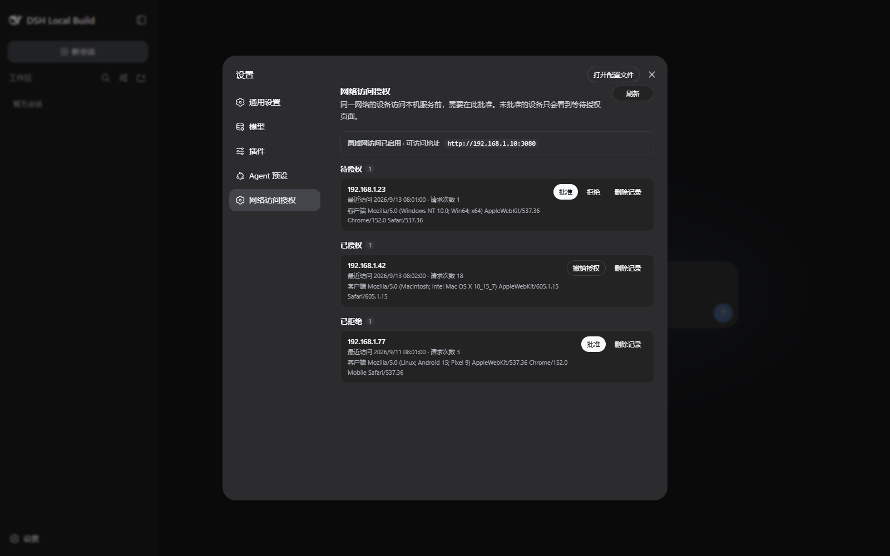

# DeepSeek Harness 局域网和远程工作区

面向 [DeepSeek Harness](https://github.com/deepseek-ai/deepseek-harness) 的 Codex Skill，用中文文档和操作流程为项目补齐两套远程访问能力：

- **局域网访问授权**：等待授权页、持久化白名单、WebSocket 升级拦截，以及设置页中的批准、拒绝、撤销和删除。
- **SSH 远程工作区**：SSH 设备注册、`ssh://<connectionId>/<absolute path>` 工作区标识、远端目录浏览、远端文件读写和沙箱边界。



> 上图为真实界面效果。安装并应用 Skill 后，设置侧栏会多出 **“网络访问授权”**，用于查看待授权设备、批准或拒绝访问、撤销授权和删除记录。截图中的设备和 IP 均为演示数据。

## 先说明区别

这个仓库本身是 **Codex Skill**，不是 DeepSeek Harness 安装包，也不能仅靠 `git clone` 自动修改 DSH 源码。

安装过程分成两步：

1. 把 Skill 克隆到 Codex 技能目录，让 Codex 能识别 `$deepseek-harness-remote-access`。
2. 在 DeepSeek Harness 源码仓库中调用该 Skill，完成代码接线、测试和构建。

完成第 2 步并重启 Web 服务后，设置里才会出现截图中的 **“网络访问授权”**。

## 1. 环境要求

- Windows 10/11、macOS 或 Linux
- [Codex 桌面应用](https://openai.com/codex/) 或支持 `$skill` 的 Codex 环境
- Git
- 修改 DeepSeek Harness 时还需要 Node.js 和 pnpm
- DSH 版本要求以目标仓库的 `package.json` 为准；本文验证版本为 `0.1.1-rc.2`

检查命令：

```sh
git --version
node --version
pnpm --version
```

## 2. 安装 Skill

### Windows PowerShell

复制以下命令并在 PowerShell 中执行：

```powershell
$skillRoot = if ($env:CODEX_HOME) {
  Join-Path $env:CODEX_HOME 'skills'
} else {
  Join-Path $HOME '.codex\skills'
}
$target = Join-Path $skillRoot 'deepseek-harness-remote-access'

New-Item -ItemType Directory -Path $skillRoot -Force | Out-Null
git clone https://github.com/shell-error/deepseek-harness-remote-access.git $target

Test-Path (Join-Path $target 'SKILL.md')
```

最后一行返回 `True`，说明 Skill 已放到正确位置。

### macOS / Linux

```sh
SKILL_ROOT="${CODEX_HOME:-$HOME/.codex}/skills"
git clone https://github.com/shell-error/deepseek-harness-remote-access.git \
  "$SKILL_ROOT/deepseek-harness-remote-access"

test -f "$SKILL_ROOT/deepseek-harness-remote-access/SKILL.md" && echo "安装成功"
```

### 手动下载 ZIP

如果不使用 Git：

1. 打开本仓库首页。
2. 点击 **Code** → **Download ZIP**。
3. 解压后把目录重命名为 `deepseek-harness-remote-access`。
4. 放入以下位置之一：

```text
$CODEX_HOME/skills/deepseek-harness-remote-access/
```

未设置 `CODEX_HOME` 时：

```text
Windows: %USERPROFILE%\.codex\skills\deepseek-harness-remote-access\
macOS/Linux: ~/.codex/skills/deepseek-harness-remote-access/
```

目录名必须是 `deepseek-harness-remote-access`，并且 `SKILL.md` 必须位于该目录根部。

### 安装到 DeepSeek Harness（可选）

如果还希望 DeepSeek Harness 自己的技能加载器能发现这个 Skill，可以同时安装到 DSH 技能目录：

| 使用环境 | 默认安装目录 |
| --- | --- |
| Codex | `%USERPROFILE%\.codex\skills\deepseek-harness-remote-access\` |
| DeepSeek Harness | `%USERPROFILE%\.dsh\skills\deepseek-harness-remote-access\` |

DSH 使用 `DSH_HOME` 时，对应位置为：

```text
$DSH_HOME/skills/deepseek-harness-remote-access/
```

安装到 DSH 技能目录仍然只是让 DSH 能发现该 Skill，不会自动修改 DSH 源码。

## 3. 让 Codex 识别 Skill

安装完成后重启 Codex 桌面应用，或新建一个任务，让 Codex 重新扫描技能目录。

可在新任务中输入：

```text
使用 $deepseek-harness-remote-access，说明这个 Skill 包含哪些能力。
```

如果 Codex 能加载 Skill 并读取 `SKILL.md`，说明安装完成。

## 4. 应用到 DeepSeek Harness

### 4.1 准备 DSH 源码

```sh
git clone https://github.com/deepseek-ai/deepseek-harness.git
cd deepseek-harness
pnpm install
```

在 Codex 中打开这个 DSH 仓库，然后发送：

```text
使用 $deepseek-harness-remote-access，为当前 DeepSeek Harness 仓库实现局域网访问授权和 SSH 远程工作区。

要求：
1. 先运行 Skill 的审计脚本，确认识别到的版本和缺失接线；
2. 优先复用当前上游已有的 packages/ssh/* provider；
3. 完成后运行相关测试、typecheck 和 pnpm run build:lib；
4. 最后列出改动文件、验证结果和仍需人工确认的事项。
```

Skill 会根据任务读取以下参考文档：

- [平台集成说明](references/platform-integration.md)
- [局域网访问授权](references/lan-access.md)
- [SSH 远程工作区](references/ssh-workspaces.md)
- [源码接线映射](references/source-map.md)

### 4.2 审计目标仓库

也可以先手动审计：

```sh
node "$HOME/.codex/skills/deepseek-harness-remote-access/scripts/audit-harness.mjs" .
```

可选参数：

- `--json`：输出机器可读 JSON
- `--strict`：核心接线缺失时返回失败
- `--require-remote-shell`：把远端命令执行作为硬性要求

### 4.3 重新构建并启动

```sh
pnpm run build:lib
```

本地源码启动方式：

```sh
node apps/cli/lib/bin.js --profile web --allow-lan --port 3080
```

使用已安装的 CLI 时：

```sh
dsh --profile web --allow-lan --port 3080
```

只在需要局域网访问时添加 `--allow-lan`。如果不加，DSH 默认只监听本机 `127.0.0.1`。

## 5. 验证安装效果

1. 在本机打开 `http://127.0.0.1:3080`。
2. 进入 **设置**。
3. 如果安装和应用成功，侧栏会多出 **“网络访问授权”**。
4. 同一局域网中的新设备第一次打开 DSH 时只会看到等待授权页。
5. 回到本机设置页，在 **待授权** 中找到该设备，点击 **批准**。
6. 批准后设备可访问 DSH；之后可随时 **撤销授权**、**拒绝** 或 **删除记录**。

效果如下：


## 6. 更新 Skill

Windows PowerShell：

```powershell
$target = Join-Path $HOME '.codex\skills\deepseek-harness-remote-access'
git -C $target pull --ff-only
```

macOS / Linux：

```sh
git -C "${CODEX_HOME:-$HOME/.codex}/skills/deepseek-harness-remote-access" pull --ff-only
```

更新后重启 Codex，或新建任务。

## 7. 卸载 Skill

Windows PowerShell：

```powershell
Remove-Item -Recurse -Force (Join-Path $HOME '.codex\skills\deepseek-harness-remote-access')
```

macOS / Linux：

```sh
rm -rf "${CODEX_HOME:-$HOME/.codex}/skills/deepseek-harness-remote-access"
```

卸载 Skill 不会自动回滚已经应用到一个 DSH 源码仓库中的代码改动。

## 8. 常见问题

### 设置里没有“网络访问授权”

请按顺序检查：

- 是否已经把 Skill 安装到正确的 `skills` 目录；
- `SKILL.md` 是否位于仓库根目录；
- 是否重启了 Codex 或新建任务；
- 是否在 DSH 源码中实际调用了 Skill，而不只是克隆了本仓库；
- 是否执行了 `pnpm run build:lib`；
- 是否停止了旧服务并重新启动 Web 服务；
- 目标 DSH 版本是否与 Skill 文档中的接线兼容。

### 局域网设备一直停在等待授权页

这是预期安全行为。回到运行 DSH 的主机，打开 **设置 → 网络访问授权**，选择该设备并点击 **批准**。

同时确认：

- 启动命令包含 `--allow-lan`；
- 设备与主机在同一局域网；
- 系统防火墙允许对应端口，例如 `3080`；
- 浏览器访问的是 DSH 启动日志输出的局域网地址。

### 设置里显示“当前仅本机可访问”

说明服务只监听 `127.0.0.1`。需要局域网访问时，使用以下方式重新启动：

```sh
dsh --profile web --allow-lan --port 3080
```

### `git clone` 提示目标目录已存在

先确认目录内容，再选择更新或删除后重新安装：

```powershell
$target = Join-Path $HOME '.codex\skills\deepseek-harness-remote-access'
git -C $target pull --ff-only
```

不要在未检查内容的情况下直接删除已有目录。

### 代码执行与安全边界

- 只有明确需要局域网访问时才使用 `--allow-lan`。
- 不要把 DSH 端口直接映射到公网，也不要配置公网端口转发。
- 已批准设备只是获得可达性，仍受 `/api` 信任范围、沙箱、审批和工具策略约束。
- 旧版 SSH 实现主要让文件系统和 workspace 感知远端；`bash`、`pwsh` 和终端是否运行在远端，取决于目标版本是否挂载了 `subprocess-ssh` / `sandbox-ssh` provider。

## 名称与别名

| 位置 | 值 |
| --- | --- |
| 显示名称 | `DeepSeek Harness 局域网和远程工作区` |
| Skill 名 / GitHub 别名 | `deepseek-harness-remote-access` |

`name` 和仓库路径必须继续使用 kebab-case 英文别名，以保证 Codex、GitHub 和 Harness 加载器兼容；用户界面和文档显示中文名称。

## 验证情况

该 Skill 已在真实 DeepSeek Harness 仓库和 Web 应用上验证：

- 聚焦回归测试：170 个通过，1 个平台不适用用例跳过；
- `pnpm run build:lib` 构建通过；
- 局域网等待页、批准、撤销、拒绝、重新申请、删除、持久化和仅回环管理均已验证；
- 已注册 SSH 设备完成连接探测、远端目录浏览、文件创建/读取/编辑、相对路径解析和工作区创建；
- `Workspace Write` 模式下跨工作区远端写入会被拒绝。

验证同时确认了三个容易踩坑的实现细节：保留远端 sandbox root、映射 `ssh2` 数字 SFTP 状态码，以及使用 OpenSSH 原子覆盖 rename 完成远端编辑。

## 重要边界

旧版 SSH 实现会让文件系统和 workspace 感知远端路径，但 `bash`、`pwsh` 和终端仍运行在 Harness 主机上。如果需要完整远端命令执行，应使用当前上游的 `subprocess-ssh` 和 `sandbox-ssh` provider。
